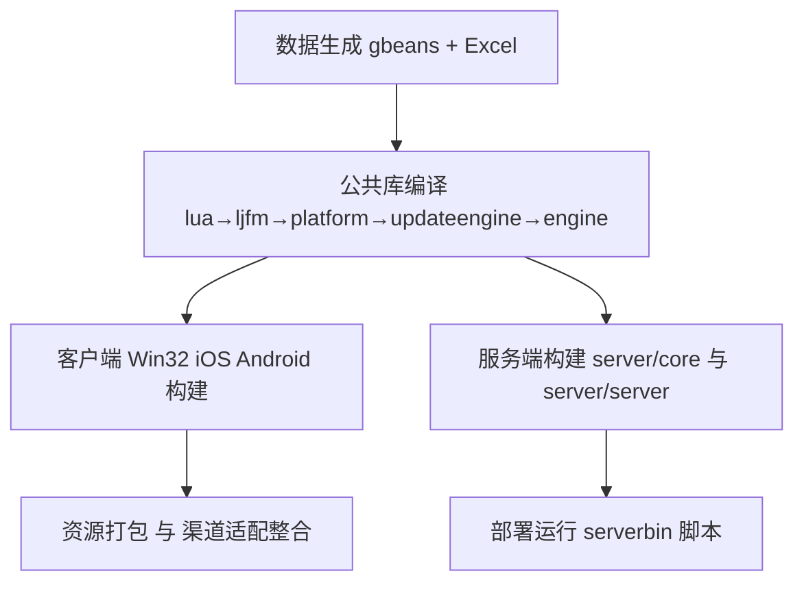

# MT3 自研组件全景 / Internal Project Components

- 最后更新时间：2025-10-19
- 适用范围：MT3 仓库内所有自研引擎、工具、服务与渠道集成组件（不含第三方依赖，见 [docs/2025-10-19-依赖项清单-Dependency-Inventory.md](docs/2025-10-19-依赖项清单-Dependency-Inventory.md)）。
- 维护联系人：平台技术组（tech@mt3.example）

---

## 目录 / Table of Contents

- 引擎与公共基础库（第2节）
- 客户端平台组件（第3节）
- 渠道与平台适配层（第4节）
- 服务端与后端工具（第5节）
- 生产工具与内容流水线（第6节）
- 数据与资源资产（第7节）
- 构建链路概览（第8节）
- 维护建议（第9节）

## 交接入口 / Handover Entry

- 关键路径索引：engine/、common/、client/、server/、tools/、scripts/、scheme_doc/、gbeans/
- 构建入口工程：
  - Windows：client/FireClient/FireClient/FireClient.sln、client/MT3Win32App/MT3Win32App.sln
  - iOS：client/FireClient/FireClient（Xcode 工程）
  - Android：client/android/common（NDK）、client/android/*（渠道工程）
  - Server：server/server/*（Ant/Maven build.xml/pom.xml）
- 常用脚本：scripts/android/*、scripts/update_doc_links.ps1、tools/packtool/*.py
- 典型产出目录：build_logs/、client/res_*/、serverbin/
- 维护人：平台技术组（tech@mt3.example），模块负责人见各节“维护人”列
- 变更登记：新增/升级模块与依赖请同时更新本文件与《依赖项清单》

---

## 1. 文档目标

1. 梳理项目必须构建或维护的全部自研模块，涵盖客户端、服务端、工具链与数据流水线。  
2. 明确每个模块的职责、语言栈、产出物与关键依赖，为构建排程、故障定位及人员交接提供参考。  
3. 补充已存在流程文档的索引，说明维护挑战与建议。

---

## 2. 引擎与公共基础库

| 组件 | 语言 | 仓库路径 | 职责 | 构建入口 | 示例构建命令 | 产出工件 | 关键依赖与版本范围 | 维护人 | 最近变更 |
| --- | --- | --- | --- | --- | --- | --- | --- | --- | --- |
| 游戏主引擎 `engine` | C++ | `engine/` | 场景、渲染、角色、粒子、地图、音频统筹 | Win32:`engine.win32.vcxproj`；Android:`engine/Android.mk` | Win32:`msbuild engine.win32.vcxproj /p:Configuration=Release /p:Platform=Win32`；Android:`ndk-build -C engine` | `engine.lib`；`libengine.a`/`libgame.so` | Cocos2d 2.0.x；CEGUI 0.7.1；FreeType 2.x；音频库 | 平台技术组 | 初始化模板 2025-10-19 |
| 引擎 Lua 绑定 `engine/tolua++-pkgs` | Lua/C++ | `engine/tolua++-pkgs/` | 生成 Lua binding，同步 C++ API | `engine/tolua++-pkgs/runtolua.bat` | `engine/tolua++-pkgs/runtolua.bat` | Lua 绑定源码 | tolua++；自建 Lua 模块 | 平台技术组 | 初始化模板 2025-10-19 |
| 公共库 `common/ljfm` | C++ | `common/ljfm/` | 资源打包与文件系统 | Win32:`ljfm.win32.vcxproj`；Android:`common/ljfm/Android.mk` | Win32:`msbuild ljfm.win32.vcxproj /p:Configuration=Release /p:Platform=Win32`；Android:`ndk-build -C common/ljfm` | `ljfm.lib`；`libljfm.a` | zlib 1.2.x | 平台技术组 | 初始化模板 2025-10-19 |
| 公共 Lua Runtime | C | `common/lua/` | 项目内置 Lua 解释器 | Win32:`lua.win32.vcxproj` | Win32:`msbuild lua.win32.vcxproj /p:Configuration=Release /p:Platform=Win32` | `lua.dll`/`lua.lib` | Lua 5.1/5.2；tolua++ | 平台技术组 | 初始化模板 2025-10-19 |
| 平台抽象 `common/platform` | C++ | `common/platform/` | 日志、INI、IO、跨平台包装 | Win32:`platform.win32.vcxproj`；移动端静态库 | Win32:`msbuild platform.win32.vcxproj /p:Configuration=Release /p:Platform=Win32` | `platform.lib`；`libplatform.a` | Win32 API；Android NDK；iOS SDK | 平台技术组 | 初始化模板 2025-10-19 |
| 更新引擎 `common/updateengine` | C++ | `common/updateengine/` | 热更新与下载管理 | Android:`common/updateengine/android`；iOS:`common/updateengine/ios` | Android:`ndk-build -C common/updateengine/android`；iOS:`xcodebuild -project <UpdateEngine.xcodeproj> -configuration Release` | `libupdateengine.a`；`.so`/AAR；（Win）`updateengine.dll` | libcurl 7.x；WinInet；平台网络库 | 平台技术组 | 初始化模板 2025-10-19 |
| RPC/认证基线 `common/cauthc` | Java/C++ | `common/cauthc/` | 协议模板、鉴权、RPC 描述 | `server/tools/rpcgen` | `java -jar server/tools/rpcgen/rpcgen.jar common/cauthc/*.xml` | 生成的 C++/Java 代码 | 自研 rpcgen；服务器核心库 | 服务端组 | 初始化模板 2025-10-19 |
| 策划数据描述 `gbeans` | XML | `gbeans/*.xml` | 游戏数据结构定义 | `server/tools/newxmerge` | `java -jar server/tools/newxmerge/xmerge.jar scheme_doc/*.xlsx` | xbeans/xdb 数据 | xmerge；transform_mkdb | 策划/数据组 | 初始化模板 2025-10-19 |

---

## 3. 客户端平台组件

### 3.1 Windows

| 组件 | 语言 | 路径 | 构建入口 | 示例构建命令 | 产出 | 依赖 | 打包脚本/流程 | 关联文档 | CI 检查点 |
| --- | --- | --- | --- | --- | --- | --- | --- | --- | --- |
| PC 客户端 `client/FireClient/FireClient` | C++/CEGUI | `client/FireClient/FireClient/` | `client/FireClient/FireClient/FireClient.sln` | `msbuild client/FireClient/FireClient/FireClient.sln /p:Configuration=Release /p:Platform=Win32` | `FireClient.exe`、`FireClient.lib` | 引擎库、CEGUI、平台库、渠道 SDK | `tools/packtool/modifyclient.py` | [docs/windows/MT3_Release_Build_Diagnostics.md](docs/windows/MT3_Release_Build_Diagnostics.md) | 编译/链接、资源包完整、启动冒烟 |
| 启动器 `client/MT3Win32App` | C++ | `client/MT3Win32App/` | `client/MT3Win32App/MT3Win32App.sln` | `msbuild client/MT3Win32App/MT3Win32App.sln /p:Configuration=Release /p:Platform=Win32` | `MT3.exe` | `platform`、`updateengine`、Win32 API | `tools/packtool/modifyclient.py` | [docs/06-编译完整指南.md](docs/06-编译完整指南.md) | 更新/下载功能验证 |
| Win32 资源包 | 资源文件 | `client/res_win/`、`client/resource/` | `client/resource/` | `ljfm` 打包（见工具说明） | `.ljfp` 资源 | `ljfm` | `tools/packtool/modifyclient.py`、`scripts/update_doc_links.ps1` | [docs/07-编译前检查清单.md](docs/07-编译前检查清单.md) | 清单、路径大小写与编码校验 |

### 3.2 iOS

| 组件 | 语言 | 路径 | 构建入口 | 示例构建命令 | 产出 | 依赖 | 打包脚本/流程 | 关联文档 | CI 检查点 |
| --- | --- | --- | --- | --- | --- | --- | --- | --- | --- |
| iOS 客户端 `FireClient/FireClient` | ObjC/ObjC++ | `client/FireClient/FireClient/` | `client/FireClient/FireClient` | `xcodebuild -project FireClient.xcodeproj -scheme FireClient -configuration Release` | `FireClient.app` | 引擎静态库、Lua、渠道 SDK、MeiQia、TalkingData | Xcode Archive 与渠道框架整合 | [docs/06-编译完整指南.md](docs/06-编译完整指南.md) | 签名/打包、启动冒烟、SDK 初始化 |
| iOS 更新模块 | ObjC++ | `common/updateengine/ios` | `common/updateengine/ios` | `xcodebuild -project UpdateEngine.xcodeproj -configuration Release` | `libupdateengine.a` | iOS Foundation/CFNetwork | - | [docs/06-编译完整指南.md](docs/06-编译完整指南.md) | 链接符号完整、网络库可用 |

### 3.3 Android

| 组件 | 语言 | 路径 | 构建入口 | 示例构建命令 | 产出 | 依赖 | 打包脚本/流程 | 关联文档 | CI 检查点 |
| --- | --- | --- | --- | --- | --- | --- | --- | --- | --- |
| 公共工程 `client/android/common` | Java/C++ | `client/android/common/` | `client/android/common` | `ndk-build -C client/android/common` | `classes.jar`、`libgame.so` | NDK r10e+、引擎库、渠道 SDK | `client/android/common/mt3_build.bat`、`client/android/common/mt3_apk.bat` | [docs/android/BUILD_GUIDE_CORRECT.md](docs/android/BUILD_GUIDE_CORRECT.md)、[docs/android/04_构建流程详解.md](docs/android/04_构建流程详解.md) | ABI/so 加载、Java 桥接初始化 |
| 官方包 `LocojoyProject` | Java/C++ | `client/android/LocojoyProject/` | `client/android/LocojoyProject` | `gradlew assembleRelease`（如使用 Gradle）或 IDE/Eclipse 构建 | `mt3_locojoy.apk` | 公共工程、渠道资源、Flurry/ShareSDK | 项目内打包脚本 | [docs/android/BUILD_GUIDE_CORRECT.md](docs/android/BUILD_GUIDE_CORRECT.md)、[docs/android/04_构建流程详解.md](docs/android/04_构建流程详解.md) | 渠道登录/支付冒烟 |
| JoySDK/Yijie 渠道包 | Java/C++ | `client/android/JoysdkProject`、`YijieProject` | `client/android/JoysdkProject`、`client/android/YijieProject` | `gradlew assembleRelease`（或相应构建方式） | 各渠道 APK | 公共工程、自研渠道适配 | 各渠道工程脚本/说明 | [docs/android/BUILD_GUIDE_CORRECT.md](docs/android/BUILD_GUIDE_CORRECT.md) | 渠道事件与统计上报 |
| Android 热更模块 | Java/C++ | `common/updateengine/android` | `common/updateengine/android` | `ndk-build -C common/updateengine/android` | AAR/`libupdateengine.so` | HTTP 库、NDK | - | [docs/android/03_环境配置指南.md](docs/android/03_环境配置指南.md) | 下载/解压/版本切换 |

### 3.4 跨平台资源与脚本

- `client/res_android/`, `client/res_ios/`, `client/res_win/`：平台专属资源包（ljfp/zip）；需与构建系统同步。
- `client/tolua++-pkgs/FireClient`：客户端 Lua 接口自动生成脚本。
- `scripts/android/*`：构建/打包批处理与 PowerShell 脚本。
- 参考文档： [docs/android/BUILD_GUIDE_CORRECT.md](docs/android/BUILD_GUIDE_CORRECT.md)、[docs/android/04_构建流程详解.md](docs/android/04_构建流程详解.md)、[docs/windows/MT3_Release_Build_Diagnostics.md](docs/windows/MT3_Release_Build_Diagnostics.md)

---

## 4. 渠道与平台适配层

| 分类 | 内容 | 路径 | 说明 |
| --- | --- | --- | --- |
| 渠道 SDK 封装 | Locojoy、Yijie、ShareSDK、Meiqia 等自研包装层 | `client/3rdplatform/` | 包含二次封装源码、Gradle Eclipse 配置及资源 |
| 支付/登录模块 | `GameSdk`、`PlatformSDK` 等 | `client/FireClient/FireClient/SDK_Locojoy`、`client/android/common/src` | Objective-C/Java 适配代码，桥接游戏逻辑 |
| 统计与客服整合 | TalkingData、Chartboost、Meiqia | 同上 | 提供统一事件接口，与脚本部件联动 |

#### 接口约定（Bridge Conventions）

- 初始化时序
  - Android：Application.onCreate → 平台 SDK 初始化 → 登录/支付组件懒加载 → 游戏事件桥接注册。
  - iOS：AppDelegate didFinishLaunching → 渠道框架初始化 → 观察者/通知注册 → 业务模块启用。
- 命名规范
  - Java 方法：PlatformSdk.init(Context) / login(Activity) / pay(Activity, Order)
  - ObjC 接口：PlatformSDK.shared.initWithLaunchOptions: / loginFrom: / payWithOrder:
- 事件上报统一接口
  - Java：Report.event(String name, Map<String,Object> params)
  - ObjC：+ (void)event:(NSString*)name params:(NSDictionary*)params
- 线程与回调
  - 所有回调在 UI 线程分发；失败需返回可诊断 errorCode 与 message。
- 配置注入
  - 渠道配置从 assets/或 plist 读取，支持灰度开关；敏感信息避免硬编码。
- 依赖与版本
  - SDK 版本、所需最小引擎版本、ABI/架构要求需登记于“SDK 版本矩阵”。

#### SDK 版本矩阵（样例，请补齐实际版本）

| 渠道 | SDK 版本 | 引擎最小版本 | 平台最小版本 | 测试状态 | 备注 |
| --- | --- | --- | --- | --- | --- |
| Locojoy | 待补充 | engine 2.x | Android 5.0+/iOS 12+ | 待回归 | 登录/支付 |
| Yijie | 待补充 | engine 2.x | Android 5.0+ | 待回归 | 多渠道聚合 |
| ShareSDK | 待补充 | engine 2.x | Android/iOS | 通过/待回归 | 分享/社交 |
| Meiqia | 待补充 | engine 2.x | Android/iOS | 通过/待回归 | 客服 |

维护规则：版本矩阵为发布门禁；更新需同步《依赖项清单》与回归记录。

#### 变更管理流程

1. 立项：提出升级/新增渠道 → 评估影响（ABI、权限、合规、隐私）。
2. 开发：按接口约定实现桥接 → 增加冒烟与回归用例。
3. 验证：联调登录、支付、统计、客服 → 记录版本矩阵状态。
4. 发布：灰度 → 全量 → 更新《依赖项清单》与本节矩阵。
5. 回滚：预置上一稳定版本包与配置，保证可快速切回。

参考：《依赖项清单》 [docs/2025-10-19-依赖项清单-Dependency-Inventory.md](docs/2025-10-19-依赖项清单-Dependency-Inventory.md)

---

## 5. 服务端与后端工具

### 5.1 核心库（C++/Java）

| 组件 | 语言 | 路径 | 产出 | 功能 |
| --- | --- | --- | --- | --- |
| `server/core/common` | C++ | `server/core/common/` | 静态库 | 基础工具、集合、日志 |
| `server/core/io` | C++ | `server/core/io/` | 静态库 | 网络 IO 层，封装 NIO/Epoll |
| `server/core/jio` | Java | `server/core/jio/` | `jio.jar` | Java 接入层，供工具与服务器调用 |
| `server/core/mk` | C++ | `server/core/mk/` | 静态库 | mkdb 数据库接口 |
| `server/core/rpc` | C++ | `server/core/rpc/` | 静态库 | RPC 框架 |

### 5.2 业务服务器

| 模块 | 语言 | 路径 | 主要职责 | 运行构件 |
| --- | --- | --- | --- | --- |
| `game_server` | Java | `server/server/game_server/` | 主业务逻辑 | `gs.jar`、`gsxdb.jar` |
| `gate_server` | Java | `server/server/gate_server/` | 网关/长连接调度 | `gate.jar` |
| `name_server` | Java | `server/server/name_server/` | 名字服务/唯一性校验 | `name.jar` |
| `sdk_server` | Java | `server/server/sdk_server/` | 支付回调、渠道对接 | `sdk.jar` |
| `proxy_server` | Java | `server/server/proxy_server/` | 跨区/跨服代理 | `proxy.jar` |
| `zone_server` | Java | `server/server/zone_server/` | 分区负载与世界同步 | `zone.jar` |
| `trans_server` | Java | `server/server/trans_server/` | 数据转储/迁移 | `trans.jar` |
| `spirit_server` | Java | `server/server/spirit_server/` | 灵兽等专项逻辑 | `spirit.jar` |

运行时所需的配置和脚本位于 `serverbin/`，包含发布所需的 `gs/` 目录、`link/` 符号链接与 `uniqname/` 唯一名服务。

### 5.3 服务器工具链

| 工具 | 路径 | 功能 | 输出 |
| --- | --- | --- | --- |
| `newxmerge` / `xmerge` | `server/tools/newxmerge`, `server/tools/xmerge` | 策划 Excel → xbean/xdb 数据生成 | `xmerge.jar`、`xmerge_run.jar` |
| `transform_mkdb` | `server/tools/transform_mkdb` | mkdb 数据转换 | `xbean.jar` 相关工具 |
| `rpcgen` | `server/tools/rpcgen` | 根据 XML 生成 C++/Java RPC 代码 | `rpcgen.jar` |
| `monkeyking`, `xdbench`, `xclear` | `server/tools/` | 数据排查、压测、清档 | 各自运行 jar |
| `xbrowse`, `jauthc`, `jmxc` | `server/tools/` | 运行监控、权限配置、JMX 工具 | GUI/命令行工具 |

---

## 6. 生产工具与内容流水线

| 工具/目录 | 路径 | 功能 | 依赖 |
| --- | --- | --- | --- |
| CEGUI 编辑器 | `tools/CEGUI-0.7.1`, `tools/CELayoutEditor` | UI 布局/皮肤编辑 | CEGUI 运行库 |
| 资源转换工具 | `tools/AssetsConvert`, `tools/TextureCompressTool` | 美术资源到游戏格式转换 | FreeImage、NVTT |
| Excel 导表 | `tools/ExcelParse`, `tools/ExcelParse2` | 策划 Excel → 游戏数据 | Office/ODBC、xmerge |
| 任务/NPC 编辑器 | `tools/MissionEditor`, `tools/NpcList` | 剧情与NPC配置 | Win32/.NET |
| 资源校验 | `tools/validate`, `tools/PluginCheck` | 校验包体规范、插件完整性 | PowerShell/.NET |
| 构建脚本 | `scripts/` | 安卓环境检测、资源打包等 | PowerShell/BAT |
| 数据文档 | `scheme_doc/` | 策划方案与资源 | 需定期同步版本 |
| 公共脚本 | `scripts/android`、`scripts/list_big_files.ps1` | 自动化排查与打包 | PowerShell、Bash |

---

## 7. 数据与资源资产

| 资产类别 | 路径 | 说明 |
| --- | --- | --- |
| 策划方案 | `scheme_doc/` | 包含 UI、系统设计、数值文档及 PSD 素材 |
| 游戏数据 XML | `gbeans/` | 生成服务器/客户端共有的常量、配置 |
| 资源包源文件 | `client/resource/res`, `client/res_*` | 打包前原始资源（音视频、贴图、UI） |
| 运行日志模板 | `build_logs/` | 构建历史记录，辅助回归 |

---

## 8. 构建链路概览

### 8.1 概览步骤
1. 数据生成：`gbeans` + Excel → 使用 `newxmerge`、`transform_mkdb` 生成 xbean/mkdb 数据，供服务器及客户端 Lua 使用。
2. 公共库编译：按顺序构建 `common/lua` → `common/ljfm` → `common/platform` → `common/updateengine` → `engine`，确保头文件 & 库路径在 VS/NDK/Xcode 工程中已配置。
3. 客户端构建：
   - Win32：编译 `engine.lib` 后构建 `FireClient.sln`、`MT3Win32App.sln`；打包资源（ljfp）。
   - iOS：通过 Xcode 工程链接静态库，整合渠道 Framework。
   - Android：先运行 `client/android/common` NDK 编译，再通过各渠道工程产出 APK。
4. 服务端构建：以 Maven/Ant（内含 build.xml）打包 `server/server/*`，使用 `serverbin` 脚本部署；必要时执行 `rpcgen` 更新协议代码。
5. 工具/编辑器：按需在 Windows 上通过 VS/Qt/.NET 构建，部分工具以脚本方式运行（PowerShell/Java）。

### 8.2 可视化流程（Mermaid）

### 8.3 关键脚本与入口索引
- 数据生成：`server/tools/newxmerge`、`server/tools/transform_mkdb`
- 客户端工程入口：`client/FireClient/FireClient/FireClient.sln`、`client/MT3Win32App/MT3Win32App.sln`、`client/android/common`
- 渠道与打包：`client/android/*` 渠道工程、`tools/packtool/modifyclient.py`、`client/android/common/mt3_build.bat`、`client/android/common/mt3_apk.bat`
- 服务端构建与部署：`server/server/*`（build.xml/pom.xml）、`serverbin/`

参考：依赖项清单 [docs/2025-10-19-依赖项清单-Dependency-Inventory.md](docs/2025-10-19-依赖项清单-Dependency-Inventory.md)

---

## 9. 维护建议

- 建立统一的构建矩阵，确保所有 VS/NDK/Xcode 工程引用引用最新公共库与脚本，避免版本漂移。  
- 对 `server/tools` 内部 Jar 保留源代码或构建脚本，防止二进制漂白无法重建。  
- 每次渠道 SDK 升级同步更新自研封装层，并在本清单中修订说明。  
- 对策划数据（`gbeans`、`scheme_doc`）执行版本管理与差异审查，确保服务器与客户端同步。  
- 配合《依赖项清单》对第三方组件进行补丁管理，避免与自研模块耦合导致滞后。  
- 推动将关键工具与引擎模块纳入 CI，自动验证 Windows/iOS/Android/Server 构建是否完整。  

### 附录 A：交接检查清单（示例）

- [ ] 路径与入口工程已验证（engine/common/client/server/tools/scripts/gbeans/scheme_doc）
- [ ] 示例构建命令可执行（Win32/iOS/Android/Server）
- [ ] 资源打包完成且校验通过（清单/大小写/编码/重复）
- [ ] 渠道 SDK 与桥接层冒烟（登录/支付/统计/客服）
- [ ] 依赖项清单与版本矩阵已更新并通过回归
- [ ] serverbin 配置与符号链接结构就位，服务可启动
- [ ] CI 构建矩阵项均绿（关键模块）

### 附录 B：构建矩阵模板（按行维护）

| 平台 | 模块 | 构建入口 | 产出工件 | 关键依赖 | 负责人 | CI 校验项 | 状态 |
| --- | --- | --- | --- | --- | --- | --- | --- |
| Windows | engine | engine.win32.vcxproj | engine.lib | CEGUI/Cocos2d/FreeType | 平台组 | 编译/链接/单测 | 待补 |
| Android | common | client/android/common | libgame.so/classes.jar | NDK/渠道SDK | 客户端组 | ABI/加载/冒烟 | 待补 |
| Server | game_server | server/server/game_server | gs.jar | JDK/库 | 服务端组 | 启动/接口/压测 | 待补 |

### 附录 C：索引更新建议

- 在索引与目录文件中添加双向跳转：
  - 总索引：[docs/INDEX.md](docs/INDEX.md)
  - 文档索引：[docs/13-文档索引.md](docs/13-文档索引.md)
  - 平台指南： [docs/windows/MT3_Release_Build_Diagnostics.md](docs/windows/MT3_Release_Build_Diagnostics.md)、[docs/android/BUILD_GUIDE_CORRECT.md](docs/android/BUILD_GUIDE_CORRECT.md)

> 如需补充更多模块，请在表格中新增条目并标注产出与依赖，同时更新构建链路描述。建议以季度频率回顾本文档。