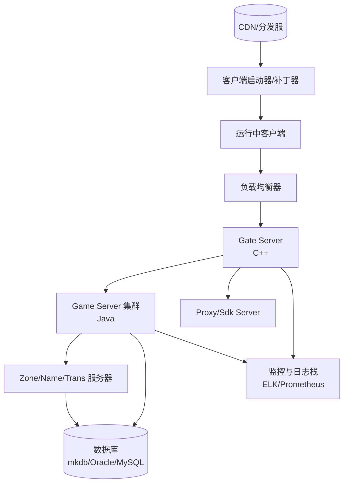

# MT3 文档适配与体系指引 / Documentation Adaptation Guide

> 适用范围：MT3 项目的通用文档体系与跨团队协同。编写或重构资料前，请先阅读本指引。

---

## 1. 编码与命名规范

- **文件编码**
  - Markdown、脚本与配置统一使用 `UTF-8`（无 BOM）。若现有文件为 GBK/ANSI，应在修改前转换为 UTF-8 并校验中文显示。
  - 二进制素材（图片、压缩包）保持原格式；提交前确认描述文档中引用路径正确。
- **文件命名**
  - 新文档采用 `<YYYY-MM-DD>-<简体中文标题>-<English-Title>.md`，示例：`2025-10-21-文档适配与体系指引-Documentation-Adaptation-Guide.md`。
  - 目录下的主题文档以两位数字排序（如 `01-`, `02-`）时，保持既有编号含义，不随意跳号。
  - 代码文件命名遵循各端既有约定：客户端 C++ 使用 PascalCase 类型名、snake_case 工具脚本；服务端 Java 包名小写、类名 PascalCase；Lua/JS 模块沿用业务缩写。
- **内容结构**
  - 文档首屏包含标题、适用范围、最近更新时间（建议）。
  - 章节使用 `##` 层级；流程/表格优先使用 Markdown 表格或列表，避免复制图片描述文字。
  - 中英文混排时，英文术语使用半角空格分隔，保持便于检索。
- **链接与附件**
  - 引用仓库内文件使用相对路径；外链需给出协议头，定期在 `docs/INDEX.md` 执行链接巡检。
  - 临时调研材料放置于 `docs/research/`，正式指引合并前需转入 `docs/` 并按命名规则重命名。

---

## 2. 高层架构总览

```mermaid
flowchart LR
    subgraph Client[客户端]
        C1[C++ 核心引擎<br/>engine/]
        C2[FireClient 游戏层<br/>client/FireClient/]
        C3[Lua/脚本协议<br/>client/FireClient/Proto*]
    end
    subgraph Shared[通用组件]
        S1[common/ 平台抽象]
        S2[dependencies/ 第三方库]
    end
    subgraph Server[服务端集群]
        GATE[Gate/GProxy<br/>server/gate_server/]
        GAME[GameServer(Java)<br/>server/game_server/gs/]
        ZONE[Zone/Name/Trans<br/>server/*_server/]
        DB[(Mkdb/XBean 数据层)]
    end
    subgraph Tooling[工具与流程]
        T1[scripts/ 自动化构建]
        T2[docs/ 规范与流程]
    end

    C1 --> C2 --> C3
    C1 --> S1
    C2 --> S1
    C3 --> GAME
    S1 --> GAME
    S2 --> C1
    S2 --> GAME
    GAME --> DB
    GATE --> GAME
    GATE --> ZONE
    T1 --> C2
    T1 --> GAME
    T2 -.-> Client
    T2 -.-> Server
```

**解读要点**
- 客户端以自研 `nu` 系列 C++ 引擎封装 Cocos2d-x，Lua 桥接承担 UI/玩法脚本。
- 服务端沿用 `gnet`/`mkdb`，Java 业务通过脚本热更实现战斗与任务逻辑；网关独立负责长连接调度。
- `common/`、`dependencies/` 统一抽象跨端功能，避免重复集成第三方库。

---

## 3. 部署拓扑示意



**部署要点**
- 客户端通过补丁器从 CDN 同步资源；正式服建议启用签名校验与差分更新。
- 网关层横向扩容，后端 Game Server 与 Zone Server 保持一主多从部署；数据层需配置主备或集群方案。
- 监控与日志统一上报（推荐 Filebeat→Logstash→ElasticSearch），关键指标涵盖在线人数、RPC 延迟、Lua/JVM 内存等。

---

## 4. 故障排查手册（首版）

| 场景 | 症状 | 快速定位步骤 | 参考资料 |
| --- | --- | --- | --- |
| 客户端无法启动 | 启动即崩 / 无窗口 | 1. 检查 `build_logs/` 是否缺少依赖 DLL<br/>2. 启动 `MT3Win32App` 时启用 `--log` 输出<br/>3. 使用 Windbg/Breakpad Dump 定位堆栈 | `docs/MT3_FireClient_Build_Diagnostics.md`, `dependencies/google-breakpad` |
| 登录异常 | 卡在选服 / 超时 | 1. 确认 Gate Server 端口监听<br/>2. `Gate/logs/` 查看握手阶段错误码<br/>3. 核对账号服务（Sdk Server）返回的 Token | `server/server/gate_server/gate/log4cpp.properties`, `server/server/sdk_server` |
| 战斗脚本报错 | Lua/JS 抛异常 | 1. 使用 `server/server/game_server/gs/logs` 中的错误堆栈<br/>2. 对照 `fire/script/JsFunManager.java` 的模块加载顺序<br/>3. 若为热更，确认脚本已在 `gs_lib` 缓存刷新 | `server/server/game_server/gs/src/fire/script`, `docs/2025-10-19-�������ȫ��-Internal-Project-Components.md` |
| 数据同步问题 | 玩家数据回档/丢失 | 1. 检查 `mkdb` 事务日志是否回滚<br/>2. 使用 `gnet` 压测工具复现<br/>3. 对照最近的 `gbeans/*.xml` 变更条件 | `server/server/game_server/gs/mkdb`, `gbeans/` |
| 构建脚本异常 | `rpcgen` / `mkdb` 生成失败 | 1. 确认 Java 1.6+ 与 Python 2.7 环境<br/>2. 清理 `server/server/game_server/gs/build` 后重试<br/>3. 查阅 `buildscript/` 生成日志 | `server/server/game_server/gs/buildscript`, `client/FireClient/Application/genprotocol*.bat` |

> 提示：后续新增场景请保持表格格式，按严重度分组，并在 `docs/INDEX.md` 注册链接。

---

## 5. 维护与滚动迭代

- 文档统一纳入 `docs/INDEX.md`，新增条目需在当天记录维护者与更新时间。
- 至少每季度审核一次编码与命名约束执行情况，可在代码评审清单中加入检查项。
- 若架构或部署发生重大调整，应同步更新本指引的架构/拓扑部分，并通知全体相关团队。

---

- **首次建立**：2025-10-21
- **维护者**：文档协同小组（contact: docs@mt3.example）
