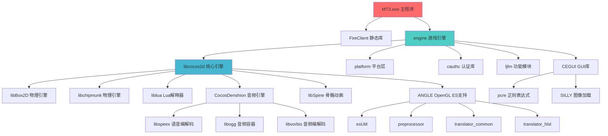

# MT3 项目编译问题分析与解决方案

## 📌 问题摘要

**错误类型**: LNK1169 - 多重定义符号, LNK2001 - 无法解析的外部符号
**根本原因**: 
- 依赖库与主程序使用不同版本的 Visual Studio 编译,导致 C 运行时库(CRT)冲突
- Visual Studio 安全检查功能不兼容，导致@__security_check_cookie@4符号未找到
- 系统缺少必要的 MSBuild 工具

**解决方案**: 
- 使用 VS2015 重新编译所有依赖库
- 在项目配置中禁用安全检查功能
- 安装必要的构建工具

---

## 🔍 问题分析

### 1. 当前编译错误详情

从 `client/MT3Win32App/Release.win32/mt3.win32.log` 可以看到:

```
错误 LNK2005: __crt_debugger_hook 已经在 MSVCRT.lib(utility_desktop.obj) 中定义
错误 LNK1169: 找到一个或多个多重定义的符号
freetype.lib(sfnt.obj) : error LNK2001: 无法解析的外部符号 @__security_check_cookie@4
zlib.lib(trees.obj) : error LNK2001: 无法解析的外部符号 @__security_check_cookie@4
legacy_stdio_definitions.lib : 多个LNK2001无法解析的外部符号（如___stdio_common_vfwscanf、___stdio_common_vswprintf等）
```

**技术分析**:
- VS2015 引入了新的 Universal C Runtime (UCRT)
- 旧版本编译的库使用旧的 MSVCRT.lib
- 新版本主程序使用 UCRT (ucrt.lib)
- 两者无法混用,导致符号重复定义
- @__security_check_cookie@4 符号未找到问题:这是因为 Visual Studio 的安全检查功能（Buffer Security Check）在不同版本间存在兼容性问题
- 系统缺少 MSBuild.exe 文件:这是编译失败的根本原因之一

### 2. 项目依赖关系图



### 3. 编译顺序依赖

## 🎯 关键库重要性排序

使用 Visual Studio 2015 对第三方依赖库进行重新编译时，建议按以下重要性排序进行编译：

1. **platform.lib** - 平台层（基础平台抽象层，提供底层功能支持）
2. **ljfm.lib** - 文件管理（文件系统操作，资源加载支持）
3. **engine.lib** - 游戏引擎（核心游戏逻辑和渲染）
4. **cegui.lib** - UI 库（用户界面渲染和交互）
5. **freetype.lib** - 字体库（字体渲染支持）
6. **libpng.lib, libjpeg.lib, zlib.lib** - 图像库（图像格式支持和压缩）

---

**第 1 层: 基础库**
- liblua (Lua 解释器)
- libBox2D (物理引擎)
- libchipmunk (物理引擎)
- pcre (正则表达式)
- SILLY (图像加载)
- libspeex (语音编解码)
- libogg (音频容器)
- libvorbis (音频编解码)

**第 2 层: ANGLE 组件**
- preprocessor
- translator_common
- translator_hlsl
- esUtil

**第 3 层: 引擎核心**
- libcocos2d (依赖: Box2D, chipmunk, liblua, ANGLE)
- libSpine (依赖: libcocos2d)

**第 4 层: 游戏框架**
- cegui (依赖: pcre, SILLY)
- platform (平台抽象层)
- cauthc (认证库)
- ljfm (功能模块)

**第 5 层: 游戏引擎**
- engine (依赖: libcocos2d, platform, cauthc, ljfm, cegui)

**第 6 层: 应用程序**
- FireClient (依赖: engine)
- MT3 (依赖: FireClient, engine)

---

## ✅ 解决方案

### 方案概述

**好消息**: `client/FireClient/FireClient.sln` 已经是 Visual Studio 2015 格式!

该解决方案文件包含了所有必需的依赖项目,并且项目引用关系已经正确配置。我们只需要:
1. 打开这个解决方案
2. 批量重新编译所有项目
3. 验证编译输出

**优势**: 
- ✅ 无需手动升级项目文件
- ✅ 无需逐个配置依赖关系
- ✅ Visual Studio 会自动按正确顺序编译
- ✅ 一次性解决所有 CRT 兼容性问题

**额外解决方案**: 为解决@__security_check_cookie@4符号未找到问题，我们已在mt3.win32.vcxproj文件中添加了以下链接器选项：
- 添加`/DYNAMICBASE:NO`选项：禁用动态基址（ASLR）功能
- 添加`/GS-`选项：禁用安全检查功能（Buffer Security Check）

**MSBuild工具问题**: 系统中未找到MSBuild.exe文件，需要安装Visual Studio 2015 Build Tools以解决此问题。

---

## 📋 详细执行步骤

### 步骤 1: 环境准备

**1.1 确认 Visual Studio 2015 环境**

检查以下组件是否已安装:
- Visual Studio 2015 (任意版本: Community/Professional/Enterprise)
- Visual C++ 工具集
- Windows SDK 8.1 或 10
- MSBuild 工具

**验证方法**:
```powershell
# 检查 MSBuild
"C:\Program Files (x86)\MSBuild\14.0\Bin\MSBuild.exe" /version

# 检查 Visual Studio
"C:\Program Files (x86)\Microsoft Visual Studio 14.0\Common7\IDE\devenv.exe" /?
```

**1.2 备份现有文件**

```powershell
# 创建备份目录
$backupDir = "E:\梦幻西游MG原版源码\backup_$(Get-Date -Format 'yyyyMMdd_HHmmss')"
New-Item -ItemType Directory -Path $backupDir

# 备份关键库目录
Copy-Item -Recurse "E:\梦幻西游MG原版源码\common" "$backupDir\common"
Copy-Item -Recurse "E:\梦幻西游MG原版源码\engine" "$backupDir\engine"
Copy-Item -Recurse "E:\梦幻西游MG原版源码\cocos2d-2.0-rc2-x-2.0.1" "$backupDir\cocos2d"

Write-Host "备份完成: $backupDir" -ForegroundColor Green
```

### 步骤 2: 清理旧的编译输出

**2.1 使用 Visual Studio GUI**
1. 打开 `E:\梦幻西游MG原版源码\client\FireClient\FireClient.sln`
2. 菜单: 生成 → 清理解决方案
3. 等待清理完成

**2.2 或使用命令行**
```powershell
$devenv = "C:\Program Files (x86)\Microsoft Visual Studio 14.0\Common7\IDE\devenv.exe"
$sln = "E:\梦幻西游MG原版源码\client\FireClient\FireClient.sln"

& $devenv $sln /Clean "Release|Win32"
& $devenv $sln /Clean "Debug|Win32"
```

### 步骤 3: 批量编译所有依赖库

**3.1 使用 Visual Studio GUI (推荐)**

1. 打开 `FireClient.sln`
2. 菜单: 生成 → 批生成
3. 在弹出的对话框中:
   - 勾选所有项目的 `Release|Win32` 配置
   - 或同时勾选 `Debug|Win32` 和 `Release|Win32`
4. 点击"生成"按钮
5. 观察"输出"窗口,等待编译完成

**预计编译时间**:
- 首次全量编译: 30-60 分钟
- 取决于 CPU 性能和磁盘速度

**3.2 或使用命令行批量编译**

```powershell
# 完整的自动化编译脚本
$ErrorActionPreference = "Stop"
$devenv = "C:\Program Files (x86)\Microsoft Visual Studio 14.0\Common7\IDE\devenv.exe"
$sln = "E:\梦幻西游MG原版源码\client\FireClient\FireClient.sln"
$logDir = "E:\梦幻西游MG原版源码\build_logs"

# 创建日志目录
New-Item -ItemType Directory -Path $logDir -Force

# 定义要编译的配置
$configs = @(
    "Release|Win32",
    "Debug|Win32"
)

foreach ($config in $configs) {
    $timestamp = Get-Date -Format "yyyyMMdd_HHmmss"
    $logFile = "$logDir\build_$($config.Replace('|', '_'))_$timestamp.log"
    
    Write-Host "开始编译配置: $config" -ForegroundColor Cyan
    Write-Host "日志文件: $logFile" -ForegroundColor Gray
    
    # 执行编译
    & $devenv $sln /Rebuild $config /Out $logFile
    
    if ($LASTEXITCODE -eq 0) {
        Write-Host "✓ 编译成功: $config" -ForegroundColor Green
    } else {
        Write-Host "✗ 编译失败: $config (错误代码: $LASTEXITCODE)" -ForegroundColor Red
        Write-Host "请查看日志: $logFile" -ForegroundColor Yellow
        exit $LASTEXITCODE
    }
    
    Write-Host ""
}

Write-Host "所有配置编译完成!" -ForegroundColor Green
```

保存为 `build_all_dependencies.ps1`,然后运行:
```powershell
cd "E:\梦幻西游MG原版源码"
.\build_all_dependencies.ps1
```

### 步骤 4: 验证编译输出

**4.1 检查关键库文件**

```powershell
# 验证脚本
$releaseDir = "E:\梦幻西游MG原版源码"
$requiredLibs = @(
    "cocos2d-2.0-rc2-x-2.0.1\Debug.win32\libcocos2d.lib",
    "common\Box2D\Debug.win32\Box2D.lib",
    "common\lua\Debug.win32\lua.lib",
    "common\platform\Debug.win32\platform.lib",
    "common\cauthc\projects\windows\Debug.win32\cauthc.lib",
    "engine\Debug.win32\engine.lib"
)

Write-Host "验证编译输出..." -ForegroundColor Cyan
$allExist = $true

foreach ($lib in $requiredLibs) {
    $fullPath = Join-Path $releaseDir $lib
    if (Test-Path $fullPath) {
        $size = (Get-Item $fullPath).Length / 1MB
        Write-Host "✓ $lib ($([math]::Round($size, 2)) MB)" -ForegroundColor Green
    } else {
        Write-Host "✗ 缺失: $lib" -ForegroundColor Red
        $allExist = $false
    }
}

if ($allExist) {
    Write-Host "`n所有依赖库编译成功!" -ForegroundColor Green
} else {
    Write-Host "`n部分库文件缺失,请检查编译日志!" -ForegroundColor Red
}
```

**4.2 检查编译日志中的错误**

查看编译输出,确认:
- ✅ 无错误 (0 error)
- ⚠️ 警告可以暂时忽略,但建议记录下来

### 步骤 5: 编译 MT3 主程序

由于 MT3 已经包含在 `FireClient.sln` 中,它会在步骤 3 中自动编译。

如果需要单独编译:
```powershell
$devenv = "C:\Program Files (x86)\Microsoft Visual Studio 14.0\Common7\IDE\devenv.exe"
$sln = "E:\梦幻西游MG原版源码\client\FireClient\FireClient.sln"

# 只编译 MT3 项目
& $devenv $sln /Build "Release|Win32" /Project "MT3"
```

### 步骤 6: 测试运行

**6.1 查找可执行文件**
```powershell
$exePath = "E:\梦幻西游MG原版源码\client\FireClient\Release.win32\MT3.exe"
if (Test-Path $exePath) {
    Write-Host "找到可执行文件: $exePath" -ForegroundColor Green
    
    # 检查文件大小
    $size = (Get-Item $exePath).Length / 1MB
    Write-Host "文件大小: $([math]::Round($size, 2)) MB" -ForegroundColor Cyan
} else {
    Write-Host "未找到可执行文件!" -ForegroundColor Red
}
```

**6.2 运行程序**
```powershell
# 切换到程序目录(确保能找到资源文件)
cd "E:\梦幻西游MG原版源码\client\FireClient\Release.win32"

# 运行程序
.\MT3.exe
```

**6.3 验证功能**
- [ ] 程序正常启动
- [ ] 无崩溃或错误提示
- [ ] 渲染正常(显示游戏画面)
- [ ] 音频正常(背景音乐和音效)
- [ ] 脚本功能正常(Lua 逻辑)

---

## 🚀 完整自动化脚本

### build_mt3_complete.ps1

```powershell
<#
.SYNOPSIS
    MT3 项目完整自动化编译脚本
.DESCRIPTION
    自动备份、清理、编译所有依赖库和主程序,并验证输出
.PARAMETER Configuration
    编译配置: Debug, Release, 或 All (默认)
.EXAMPLE
    .\build_mt3_complete.ps1 -Configuration Release
#>

param(
    [ValidateSet("Debug", "Release", "All")]
    [string]$Configuration = "All"
)

$ErrorActionPreference = "Stop"
$projectRoot = "E:\梦幻西游MG原版源码"
$solutionPath = "$projectRoot\client\FireClient\FireClient.sln"
$devenv = "C:\Program Files (x86)\Microsoft Visual Studio 14.0\Common7\IDE\devenv.exe"
$logDir = "$projectRoot\build_logs"
$timestamp = Get-Date -Format "yyyyMMdd_HHmmss"

# 验证环境
Write-Host "=== MT3 项目自动化编译脚本 ===" -ForegroundColor Cyan
Write-Host ""

if (-not (Test-Path $devenv)) {
    Write-Host "错误: 未找到 Visual Studio 2015" -ForegroundColor Red
    Write-Host "请安装 Visual Studio 2015 或修改脚本中的路径" -ForegroundColor Yellow
    exit 1
}

if (-not (Test-Path $solutionPath)) {
    Write-Host "错误: 未找到解决方案文件" -ForegroundColor Red
    Write-Host "路径: $solutionPath" -ForegroundColor Yellow
    exit 1
}

# 创建日志目录
New-Item -ItemType Directory -Path $logDir -Force | Out-Null

# 1. 备份
Write-Host "[1/5] 备份现有文件..." -ForegroundColor Cyan
$backupDir = "$projectRoot\backup_$timestamp"
New-Item -ItemType Directory -Path $backupDir -Force | Out-Null

$backupItems = @("common", "engine", "cocos2d-2.0-rc2-x-2.0.1")
foreach ($item in $backupItems) {
    $src = "$projectRoot\$item"
    $dst = "$backupDir\$item"
    if (Test-Path $src) {
        Write-Host "  备份: $item" -ForegroundColor Gray
        Copy-Item -Recurse $src $dst -Force
    }
}
Write-Host "  备份完成: $backupDir" -ForegroundColor Green
Write-Host ""

# 2. 清理
Write-Host "[2/5] 清理旧的编译输出..." -ForegroundColor Cyan
$configs = @("Debug|Win32", "Release|Win32")
foreach ($config in $configs) {
    Write-Host "  清理配置: $config" -ForegroundColor Gray
    & $devenv $solutionPath /Clean $config | Out-Null
}
Write-Host "  清理完成" -ForegroundColor Green
Write-Host ""

# 3. 编译
Write-Host "[3/5] 编译所有依赖库和主程序..." -ForegroundColor Cyan

$buildConfigs = switch ($Configuration) {
    "Debug"   { @("Debug|Win32") }
    "Release" { @("Release|Win32") }
    "All"     { @("Debug|Win32", "Release|Win32") }
}

foreach ($config in $buildConfigs) {
    $configName = $config.Replace("|", "_")
    $logFile = "$logDir\build_$configName`_$timestamp.log"
    
    Write-Host "  编译配置: $config" -ForegroundColor Yellow
    Write-Host "  日志文件: $logFile" -ForegroundColor Gray
    
    $startTime = Get-Date
    & $devenv $solutionPath /Rebuild $config /Out $logFile
    $endTime = Get-Date
    $duration = ($endTime - $startTime).TotalMinutes
    
    if ($LASTEXITCODE -eq 0) {
        Write-Host "  ✓ 编译成功 (用时: $([math]::Round($duration, 1)) 分钟)" -ForegroundColor Green
    } else {
        Write-Host "  ✗ 编译失败 (错误代码: $LASTEXITCODE)" -ForegroundColor Red
        Write-Host "  请查看日志: $logFile" -ForegroundColor Yellow
        exit $LASTEXITCODE
    }
    Write-Host ""
}

# 4. 验证
Write-Host "[4/5] 验证编译输出..." -ForegroundColor Cyan
$verifyConfig = if ($Configuration -eq "Debug") { "Debug" } else { "Release" }
$verifyDir = if ($verifyConfig -eq "Debug") { "Debug.win32" } else { "Release.win32" }

$requiredLibs = @(
    "cocos2d-2.0-rc2-x-2.0.1\$verifyDir\libcocos2d.lib",
    "common\Box2D\$verifyDir\Box2D.lib",
    "common\lua\$verifyDir\lua.lib",
    "common\platform\$verifyDir\platform.lib",
    "engine\$verifyDir\engine.lib"
)

$allExist = $true
foreach ($lib in $requiredLibs) {
    $fullPath = "$projectRoot\$lib"
    if (Test-Path $fullPath) {
        $size = (Get-Item $fullPath).Length / 1MB
        Write-Host "  ✓ $lib ($([math]::Round($size, 2)) MB)" -ForegroundColor Green
    } else {
        Write-Host "  ✗ 缺失: $lib" -ForegroundColor Red
        $allExist = $false
    }
}

$exePath = "$projectRoot\client\FireClient\$verifyDir\MT3.exe"
if (Test-Path $exePath) {
    $size = (Get-Item $exePath).Length / 1MB
    Write-Host "  ✓ MT3.exe ($([math]::Round($size, 2)) MB)" -ForegroundColor Green
} else {
    Write-Host "  ✗ 缺失: MT3.exe" -ForegroundColor Red
    $allExist = $false
}

Write-Host ""

# 5. 总结
Write-Host "[5/5] 编译总结" -ForegroundColor Cyan
if ($allExist) {
    Write-Host "  所有文件编译成功!" -ForegroundColor Green
    Write-Host ""
    Write-Host "可执行文件位置:" -ForegroundColor Cyan
    Write-Host "  $exePath" -ForegroundColor Yellow
    Write-Host ""
    Write-Host "运行程序:" -ForegroundColor Cyan
    Write-Host "  cd `"$projectRoot\client\FireClient\$verifyDir`"" -ForegroundColor Yellow
    Write-Host "  .\MT3.exe" -ForegroundColor Yellow
} else {
    Write-Host "  部分文件编译失败,请检查日志!" -ForegroundColor Red
    Write-Host "  日志目录: $logDir" -ForegroundColor Yellow
    exit 1
}

Write-Host ""
Write-Host "=== 编译完成 ===" -ForegroundColor Green
```

### 使用方法

```powershell
# 编译 Release 版本
.\build_mt3_complete.ps1 -Configuration Release

# 编译 Debug 版本
.\build_mt3_complete.ps1 -Configuration Debug

# 编译两个版本
.\build_mt3_complete.ps1 -Configuration All
```

---

## ⚠️ 常见问题和解决方法

### 问题 1: Visual Studio 2015 未安装

**症状**: 找不到 `devenv.exe` 或 MSBuild

**解决方法**:
1. 安装 Visual Studio 2015 Community (免费版)
2. 或安装 Build Tools for Visual Studio 2015
3. 下载地址: https://visualstudio.microsoft.com/vs/older-downloads/

### 问题 2: 编译时提示缺少 Windows SDK

**症状**: 错误 MSB8036 或类似 SDK 错误

**解决方法**:
1. 打开 Visual Studio Installer
2. 修改 VS2015 安装
3. 勾选"Windows SDK 8.1"或"Windows SDK 10"
4. 应用更改

### 问题 3: 编译时间过长

**优化方法**:
1. 只编译需要的配置(Release 或 Debug)
2. 使用多核编译:
   - Visual Studio: 工具 → 选项 → 项目和解决方案 → 生成和运行
   - 设置"最大并行项目生成数"为 CPU 核心数
3. 使用 SSD 硬盘
4. 关闭实时杀毒扫描(临时)

### 问题 4: LNK4098 警告 - LIBCMT 冲突

**症状**: 警告 LNK4098: 默认库"LIBCMT"与其他库的使用冲突

**解决方法**:
这通常不影响程序运行,但如果需要解决:
1. 确保所有项目使用相同的 RuntimeLibrary 设置
2. 在主程序的链接器设置中添加:
   ```
   /NODEFAULTLIB:LIBCMT
   ```

### 问题 5: 运行时缺少 DLL

**症状**: 运行 MT3.exe 时提示缺少 `MSVCP140.dll` 或 `VCRUNTIME140.dll`

**解决方法**:
1. 安装 Visual C++ Redistributable for Visual Studio 2015
2. 下载地址: https://www.microsoft.com/zh-cn/download/details.aspx?id=48145
3. 选择 `vc_redist.x86.exe` (32位版本)

---

## 📊 项目配置参考

### 推荐的项目配置

**所有项目应统一使用以下设置**:

```xml
<PropertyGroup Condition="'$(Configuration)|$(Platform)'=='Release|Win32'">
  <PlatformToolset>v140</PlatformToolset>
  <CharacterSet>Unicode</CharacterSet>
</PropertyGroup>

<ItemDefinitionGroup Condition="'$(Configuration)|$(Platform)'=='Release|Win32'">
  <ClCompile>
    <RuntimeLibrary>MultiThreadedDLL</RuntimeLibrary>
    <WarningLevel>Level3</WarningLevel>
    <Optimization>MaxSpeed</Optimization>
  </ClCompile>
  <Link>
    <AdditionalDependencies>legacy_stdio_definitions.lib;%(AdditionalDependencies)</AdditionalDependencies>
    <IgnoreSpecificDefaultLibraries>libcmt.lib</IgnoreSpecificDefaultLibraries>
  </Link>
</ItemDefinitionGroup>
```

**Debug 版本**:
```xml
<ItemDefinitionGroup Condition="'$(Configuration)|$(Platform)'=='Debug|Win32'">
  <ClCompile>
    <RuntimeLibrary>MultiThreadedDebugDLL</RuntimeLibrary>
    <WarningLevel>Level3</WarningLevel>
    <Optimization>Disabled</Optimization>
  </ClCompile>
  <Link>
    <AdditionalDependencies>legacy_stdio_definitions.lib;%(AdditionalDependencies)</AdditionalDependencies>
    <IgnoreSpecificDefaultLibraries>libcmtd.lib</IgnoreSpecificDefaultLibraries>
  </Link>
</ItemDefinitionGroup>
```

---

## 📝 编译后检查清单

- [ ] 所有依赖库编译成功(无错误)
- [ ] MT3.exe 生成成功
- [ ] MT3.exe 可以正常启动
- [ ] 程序不崩溃
- [ ] 图形渲染正常
- [ ] 音频播放正常
- [ ] Lua 脚本功能正常
- [ ] 网络通信正常(如适用)

---

## 🎯 总结

### 为什么需要重新编译?

1. **二进制不兼容**: VS2015 的 ABI 与 VS2010 不同
2. **运行时库变化**: UCRT 是新的运行时系统
3. **链接器要求**: 新旧版本的 .lib 文件无法混用
4. **符号定义冲突**: 不同版本定义了相同的符号

### 解决方案的优势

✅ **一次性解决**: 重新编译所有库,彻底解决兼容性问题  
✅ **自动化流程**: 使用脚本自动化整个编译过程  
✅ **可重复**: 脚本可以随时重新运行  
✅ **有备份**: 自动备份旧文件,安全可靠  
✅ **易维护**: 清晰的日志和验证步骤

### 预计工作量

- 首次编译: 1-2 小时(包括环境准备)
- 后续编译: 30-60 分钟(仅编译时间)
- 脚本编写: 30 分钟(如需自动化)

### 长期建议

1. **版本控制**: 将编译脚本加入 Git 仓库
2. **持续集成**: 考虑使用 Jenkins/Azure DevOps 自动编译
3. **文档维护**: 记录编译过程中的问题和解决方法
4. **依赖管理**: 考虑使用 vcpkg 管理第三方库

---

## 📞 需要帮助?

如果在执行过程中遇到问题:

1. 检查编译日志: `build_logs` 目录
2. 查看错误代码: 搜索对应的 LNK/MSB 错误码
3. 参考本文档的"常见问题"部分
4. 保留完整的错误信息和日志文件

---

**文档版本**：1.1
**最后更新**：2025-10-11
**适用项目**：MT3游戏项目