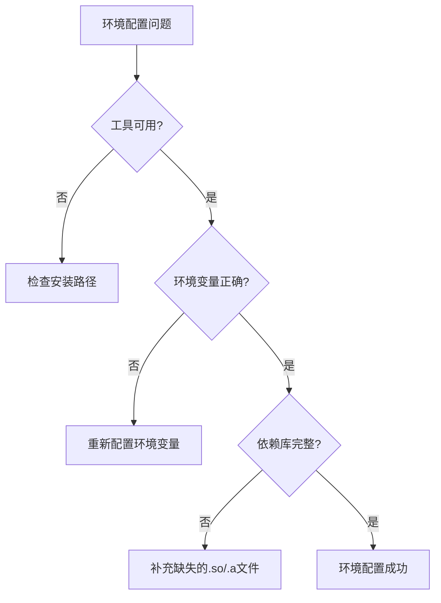

# Android 打包环境配置指南

> **目标**: 从零配置Android打包环境,确保所有工具正确安装和配置
> **适用**: MT3 Android客户端 (armeabi-v7a架构)
> **原则**: KISS(简单明了) + 一次配置,长期使用

---

## 第1章: 工具要求与版本

### 1.1 核心工具清单

| 工具 | 版本要求 | 用途 | 推荐安装路径 |
|------|---------|------|-------------|
| **JDK** | 1.8.0_144 | Java编译和签名 | C:\Program Files\Java\jdk1.8.0_144 |
| **Apache Ant** | 1.9.x | 构建自动化 | C:\apache-ant-1.9.7 |
| **Android SDK** | r24.x | Android打包工具 | C:\Program Files (x86)\Android\android-sdk |
| **Android NDK** | r10e | Native代码编译 | D:\android-ndk-r10e |
| **Keystore** | 项目提供 | APK签名 | client/android/LocojoyProject/build/mt3.keystore |

### 1.2 Android SDK 组件要求

**必需组件**:
- **Build-Tools**: 22.0.1 (包含aapt, dx, zipalign)
- **Platform**: android-22 (API Level 22)
- **Platform-tools**: (包含adb)

**组件位置**:
```
android-sdk/
├── build-tools/
│   └── 22.0.1/
│       ├── aapt.exe
│       ├── dx.bat
│       └── zipalign.exe
├── platforms/
│   └── android-22/
│       └── android.jar
└── platform-tools/
    └── adb.exe
```

### 1.3 架构限制说明

**重要**: 当前项目**仅支持 armeabi-v7a (32位)**

- ✅ 支持: armeabi-v7a 及兼容设备
- ❌ 不支持: arm64-v8a, x86, x86_64

**影响**:
- 在64-bit-only设备(如Pixel 7)无法运行
- 需在支持32位的设备或模拟器测试

---
  
## 第2章: 安装与配置步骤

### 1.4 构建脚本（build_with_log）

- 脚本路径：client/android/LocojoyProject/build_with_log.bat
- 功能：串联 ndk-build 与 ant，输出详细日志到 e:\MT3\build_logs\android_build_YYYYMMDD_HHMMSS.log。
- 使用方式：
  ```cmd
  cd e:\MT3
  cd client\android\LocojoyProject
  build_with_log.bat
  ```
- 终端提示：VS Code 默认打开的是 PowerShell，会把 `set`/`call` 等批处理语法当作 PowerShell 命令解析，导致脚本提前中断。请在 VS Code 里切换到 *Command Prompt* 终端（或运行 `cmd /c "cd /d E:\MT3\client\android\LocojoyProject && set MT3_NO_PAUSE=1 && set NDK_HOME=D:\android-ndk-r10e && build_with_log.bat"`），确保真正由 `cmd.exe` 执行脚本。
- 日志说明：执行成功或失败都会写入 e:\MT3\build_logs\android_build_YYYYMMDD_HHMMSS.log，若终端报错可先查看该文件，再结合《06_完整排错手册》定位问题。
- 注意：脚本默认以脚本所在目录（%~dp0）作为项目根，日志目录可通过环境变量 MT3_LOG_DIR 覆盖；若你的项目路径不是 e:\MT3，请按本地实际路径调整上述命令或设置 MT3_LOG_DIR 指向目标日志目录。

---
### 2.1 安装JDK 1.8.0_144

**步骤1**: 下载JDK
- 从Oracle官网或内部资源获取JDK 1.8.0_144

**步骤2**: 安装到标准路径
```
C:\Program Files\Java\jdk1.8.0_144
```

**步骤3**: 验证安装
```cmd
"C:\Program Files\Java\jdk1.8.0_144\bin\javac.exe" -version
```

**期望输出**: `javac 1.8.0_144`

---

### 2.2 安装Apache Ant

**步骤1**: 下载Ant 1.9.x
- 从Apache官网下载: https://ant.apache.org/bindownload.cgi

**步骤2**: 解压到路径
```
C:\apache-ant-1.9.7
```

**步骤3**: 验证安装
```cmd
C:\apache-ant-1.9.7\bin\ant.bat -version
```

**期望输出**: `Apache Ant(TM) version 1.9.7 ...`

---

### 2.3 安装Android SDK

**方式1**: 使用Android Studio (推荐)
1. 安装Android Studio
2. SDK Manager中安装:
   - Build-Tools 22.0.1
   - Android 5.1 (API 22)
3. 记录SDK路径(通常在`C:\Users\用户名\AppData\Local\Android\Sdk`)

**方式2**: 独立SDK工具
1. 下载SDK Tools (r24.x)
2. 解压到 `C:\Program Files (x86)\Android\android-sdk`
3. 运行SDK Manager安装所需组件

**步骤3**: 验证组件
```cmd
# 验证aapt
"C:\Program Files (x86)\Android\android-sdk\build-tools\22.0.1\aapt.exe" version

# 验证dx
call "C:\Program Files (x86)\Android\android-sdk\build-tools\22.0.1\dx.bat" --version

# 验证adb
"C:\Program Files (x86)\Android\android-sdk\platform-tools\adb.exe" version
```

---

### 2.4 安装Android NDK r10e

**步骤1**: 下载NDK r10e
- 官方下载: https://developer.android.com/ndk/downloads/older_releases
- 选择: android-ndk-r10e-windows-x86_64.zip

**步骤2**: 解压到指定路径
```
D:\android-ndk-r10e
```

**步骤3**: 验证安装
```cmd
dir /b D:\android-ndk-r10e\ndk-build.cmd
call D:\android-ndk-r10e\ndk-build.cmd --help
```

**期望输出**: 显示GNU make的使用帮助

---

### 2.5 配置环境变量

**方法1**: 系统环境变量(永久,推荐)

1. 右键"此电脑" → 属性 → 高级系统设置 → 环境变量

2. 在"系统变量"中新建:

| 变量名 | 变量值 |
|--------|-------|
| JAVA_HOME | C:\Program Files\Java\jdk1.8.0_144 |
| ANDROID_HOME | C:\Program Files (x86)\Android\android-sdk |
| ANDROID_SDK_ROOT | C:\Program Files (x86)\Android\android-sdk |
| NDK_HOME | D:\android-ndk-r10e |
| ANT_HOME | C:\apache-ant-1.9.7 |

3. 编辑系统变量"Path",添加:
```
%JAVA_HOME%\bin
%ANT_HOME%\bin
%ANDROID_HOME%\build-tools\22.0.1
%ANDROID_HOME%\platform-tools
```

**方法2**: 临时会话(仅当前终端)

**PowerShell**:
```powershell
$env:JAVA_HOME="C:\Program Files\Java\jdk1.8.0_144"
$env:ANDROID_HOME="C:\Program Files (x86)\Android\android-sdk"
$env:NDK_HOME="D:\android-ndk-r10e"
$env:ANT_HOME="C:\apache-ant-1.9.7"
$env:Path="$env:JAVA_HOME\bin;$env:ANT_HOME\bin;$env:ANDROID_HOME\build-tools\22.0.1;$env:ANDROID_HOME\platform-tools;$env:Path"
```

**CMD**:
```cmd
set "JAVA_HOME=C:\Program Files\Java\jdk1.8.0_144"
set "ANDROID_HOME=C:\Program Files (x86)\Android\android-sdk"
set "NDK_HOME=D:\android-ndk-r10e"
set "ANT_HOME=C:\apache-ant-1.9.7"
set "PATH=%JAVA_HOME%\bin;%ANT_HOME%\bin;%ANDROID_HOME%\build-tools\22.0.1;%ANDROID_HOME%\platform-tools;%PATH%"
```

---

## 第3章: 快速验证命令

### 3.1 使用PATH验证(环境变量已配置)

```cmd
# 验证所有工具
java -version && javac -version && ant -version && aapt version && adb version
```

**期望输出**:
- java version "1.8.0_144"
- javac 1.8.0_144
- Apache Ant(TM) version 1.9.7
- Android Asset Packaging Tool, v0.2
- Android Debug Bridge version 1.0.32

### 3.2 使用绝对路径验证(无需环境变量)

如果环境变量未生效,使用完整路径验证:

```cmd
# 验证JDK
"C:\Program Files\Java\jdk1.8.0_144\bin\javac.exe" -version

# 验证Ant
C:\apache-ant-1.9.7\bin\ant.bat -version

# 验证Android SDK (使用短路径避免空格问题)
"C:\Progra~2\Android\android-sdk\build-tools\22.0.1\aapt.exe" version
call "C:\Progra~2\Android\android-sdk\build-tools\22.0.1\dx.bat" --version
"C:\Progra~2\Android\android-sdk\build-tools\22.0.1\zipalign.exe" -h
"C:\Progra~2\Android\android-sdk\platform-tools\adb.exe" version

# 验证NDK
call D:\android-ndk-r10e\ndk-build.cmd --help
```

### 3.3 使用自动验证脚本

运行项目提供的验证脚本:
```cmd
cd e:\MT3
tools\validate\android_env_check.bat
```

**脚本功能**:
- 检查所有工具可用性
- 验证版本匹配
- 检查ABI配置
- 输出诊断报告

---

## 第4章: 常见环境问题

### 4.1 "javac不是内部或外部命令"

**原因**: JAVA_HOME未设置或Path配置错误

**解决方案**:
```cmd
# 临时设置
set "JAVA_HOME=C:\Program Files\Java\jdk1.8.0_144"
set "PATH=%JAVA_HOME%\bin;%PATH%"

# 验证
javac -version
```

---

### 4.2 "NDK_HOME is not set"

**原因**: NDK环境变量未设置

**解决方案**:
```cmd
# 检查NDK安装
dir /b D:\android-ndk-r10e\ndk-build.cmd

# 临时设置
set "NDK_HOME=D:\android-ndk-r10e"

# 验证
"%NDK_HOME%\ndk-build.cmd" --help
```

---

### 4.3 "aapt: command not found"

**原因**: Android SDK Build-Tools路径未加入PATH

**解决方案1**: 使用绝对路径
```cmd
"C:\Progra~2\Android\android-sdk\build-tools\22.0.1\aapt.exe" version
```

**解决方案2**: 添加到PATH
```cmd
set "PATH=%ANDROID_HOME%\build-tools\22.0.1;%PATH%"
```

---

### 4.4 PowerShell路径空格问题

**症状**: `Program Files`路径导致命令失败

**解决方案**: 使用短路径
- `C:\Program Files` → `C:\Progra~1`
- `C:\Program Files (x86)` → `C:\Progra~2`

---

### 4.5 dx报错 "UnsupportedClassVersionError"

**原因**: Java字节码版本与dx工具不匹配

**解决方案**: 确保编译目标为1.7
- 已在[build.xml](../../client/android/LocojoyProject/build.xml:214)修正为:
  ```xml
  <javac compiler="modern" source="1.7" target="1.7" ... />
  ```

---

## 第5章: 工程配置验证

### 5.1 检查NDK配置

查看 [Application.mk](../../client/android/LocojoyProject/jni/Application.mk):
```makefile
APP_ABI := armeabi-v7a
APP_PLATFORM := android-11
NDK_TOOLCHAIN_VERSION := 4.9
```

**确认**:
- ✅ APP_ABI仅为armeabi-v7a
- ❌ 不包含arm64-v8a

### 5.2 检查依赖库完整性

**预编译共享库**(.so):
```cmd
# 百度定位SDK
dir /b client\3rdplatform\BaiduLBS_AndroidSDK_Lib\libs\armeabi-v7a\liblocSDK6a.so

# DU SDK
dir /b client\3rdplatform\duClient_SDK_Lib\libs\armeabi-v7a\libdu.so
```

**静态库**(通常在cocos2d目录):
- libpng.a
- libjpeg.a
- libz.a

### 5.3 检查签名配置

```cmd
type client\android\LocojoyProject\ant.properties
```

核对关键项:
- key.store 指向的 keystore 目录是否存在
- key.alias 为证书别名

按 ant.properties 展开路径验证 keystore 是否存在，例如:
```cmd
dir /b client\android\chuhancommon\android_adt\*
```

**安全提示**:
- ⚠️ 生产环境勿在脚本中硬编码密码
- ✅ 使用环境变量或外部配置注入

---

## 第6章: 一键打包命令

### 6.1 使用增强版脚本(推荐)

```cmd
cd client\android\LocojoyProject
build_with_log.bat
```

**优势**:
- 自动记录详细日志
- 验证环境和依赖
- 失败时提供诊断信息

### 6.2 手动打包(调试用)

```cmd
# 1. 设置环境
set "NDK_HOME=D:\android-ndk-r10e"
set "MT3_NO_PAUSE=1"

# 2. NDK构建
cd client\android\LocojoyProject
mt3_build.bat

# 3. Ant打包
ant -buildfile build.xml release

# 4. 验证产物
dir /b bin\mt3_locojoy.apk
```

### 6.3 VS Code 自动化任务

- 工作区已提供 `.vscode/tasks.json`，默认任务 `android:build-apk` 会调用 `build_with_log.bat`，自动设置 `MT3_NO_PAUSE`、`MT3_LOG_DIR` 等环境变量，并使用 `cmd.exe` 避免 PowerShell 语法冲突。
- `.vscode/settings.json` 中新增 `mt3.android.ndkHome` 与 `mt3.android.sdkHome` 配置项，可按本地实际安装路径调整；任务会读取这两个值注入 `NDK_HOME` / `ANDROID_HOME`。
- 为了保证签名安全，`client/android/LocojoyProject/ant.properties` 不再保存明文口令。请在运行任务前，将 `MT3_KEYSTORE_PASSWORD` 与 `MT3_KEY_ALIAS_PASSWORD` 设为系统环境变量，或在 VS Code “终端 > 环境变量”中临时注入。
- 运行方式：在 VS Code 中执行 `终端 > 运行任务…`，选择 `android:build-apk`。执行结束后可在 `build_logs/android_build_YYYYMMDD_HHMMSS.log` 查看完整输出。

---

## 第7章: 故障排查流程



**快速诊断检查清单**:
- [ ] JDK版本正确 (`javac -version`)
- [ ] Ant可用 (`ant -version`)
- [ ] ANDROID_HOME已设置 (`echo %ANDROID_HOME%`)
- [ ] NDK_HOME已设置 (`echo %NDK_HOME%`)
- [ ] Build-Tools 22.0.1已安装
- [ ] android-22平台已安装
- [ ] ndk-build.cmd存在

---

## 🔗 相关文档

- 下一步: [02_打包前检查清单.md](02_打包前检查清单.md) - 执行打包前的系统化检查
- 快速开始: [01_快速开始.md](01_快速开始.md) - 3步完成打包
- 问题诊断: [05_问题诊断决策树.md](05_问题诊断决策树.md) - 快速定位环境问题

---

## 附录: 批量验证脚本

将以下内容保存为 `verify_env.bat`:

```cmd
@echo off
echo ====== Android 打包环境验证 ======
echo.

echo [1/5] 验证JDK...
javac -version
if errorlevel 1 (echo [FAIL] JDK未找到) else (echo [OK] JDK正常)
echo.

echo [2/5] 验证Ant...
ant -version
if errorlevel 1 (echo [FAIL] Ant未找到) else (echo [OK] Ant正常)
echo.

echo [3/5] 验证Android SDK...
aapt version
if errorlevel 1 (echo [FAIL] aapt未找到) else (echo [OK] aapt正常)
echo.

echo [4/5] 验证ADB...
adb version
if errorlevel 1 (echo [FAIL] adb未找到) else (echo [OK] adb正常)
echo.

echo [5/5] 验证NDK...
"%NDK_HOME%\ndk-build.cmd" --help > nul 2>&1
if errorlevel 1 (echo [FAIL] NDK未找到) else (echo [OK] NDK正常)
echo.

echo ====== 验证完成 ======
pause
```

---

**最后更新**: 2025-10-17
**维护者**: MT3项目组
**版本**: v2.0 (整合自v1.0环境要求文档和工具链验证指南)


