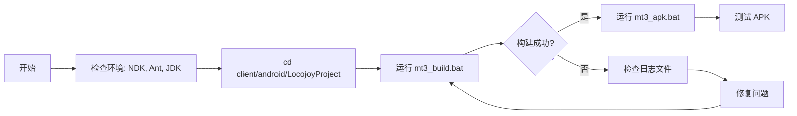

# MT3 Android 构建完整指南（修正版）

> **重要说明：** 本文档基于项目实际结构编写，替代了之前基于错误目录结构的指南。

## 📋 目录结构说明

### 实际目录结构

```
E:\MT3\
├── dependencies\               # 第三方库（实际存在）
│   ├── zlib\
│   │   └── prebuilt\android\armeabi-v7a\libz.a
│   ├── jpeg\
│   │   └── prebuilt\android\armeabi-v7a\libjpeg.a
│   └── png\
│       └── prebuilt\android\armeabi-v7a\libpng.a
├── client\android\LocojoyProject\   # Android 主项目
│   ├── jni\                    # Native 代码
│   ├── mt3_build.bat           # NDK 构建脚本 ✅
│   ├── mt3_apk.bat             # APK 打包脚本 ✅
│   └── build\                  # Ant 构建配置
└── cocos2d-2.0-rc2-x-2.0.1\   # Cocos2d-x 引擎
```

### ❌ 不存在的目录

- `E:\MT3\third_party\` - **此目录不存在，相关脚本无效**

## 🚀 正确的构建流程

### 方法 1：完整构建流程（推荐）

```powershell
# 1. 进入 Android 项目目录
cd E:\MT3\client\android\LocojoyProject

# 2. 构建 Native 代码（C++ -> .so）
.\mt3_build.bat

# 3. 打包 APK
.\mt3_apk.bat
# 选择打包类型：
#   1 = 官方版
#   2 = 月卡版
```

### 方法 2：仅重新编译 Native 代码

```powershell
cd E:\MT3\client\android\LocojoyProject
.\mt3_build.bat
```

### 方法 3：使用 PowerShell 并捕获日志

```powershell
# 使用现有的日志脚本
cd E:\MT3\client\android\LocojoyProject
.\build_with_log.bat
```

## ⚙️ 环境要求

### 必需工具

| 工具 | 版本 | 用途 | 安装路径示例 |
|------|------|------|-------------|
| Android NDK | r10e | 编译 C++ 代码 | `D:\android-ndk-r10e` |
| Apache Ant | 1.9+ | 打包 APK | 添加到 PATH |
| Java JDK | 7 或 8 | Ant 依赖 | 设置 JAVA_HOME |

### 环境变量设置

```powershell
# PowerShell
$env:NDK_HOME = "D:\android-ndk-r10e"
$env:JAVA_HOME = "C:\Program Files\Java\jdk1.8.0_xxx"
$env:PATH += ";C:\apache-ant\bin"

# 或永久设置（需要管理员权限）
[System.Environment]::SetEnvironmentVariable("NDK_HOME", "D:\android-ndk-r10e", "User")
```

```cmd
REM CMD
set "NDK_HOME=D:\android-ndk-r10e"
set "JAVA_HOME=C:\Program Files\Java\jdk1.8.0_xxx"
set "PATH=%PATH%;C:\apache-ant\bin"
```

## 📦 构建产物

### NDK 构建输出

```
client\android\LocojoyProject\libs\armeabi-v7a\
├── libcocos2d.so
├── libgame.so
└── liblocojoyproject.so
```

### APK 输出

```
client\android\LocojoyProject\build\bin\
└── LocojoyProject-release.apk
```

## 🔍 构建验证

### 检查 Native 库是否生成

```powershell
ls E:\MT3\client\android\LocojoyProject\libs\armeabi-v7a\*.so
```

**预期输出：**
```
libcocos2d.so
libgame.so
liblocojoyproject.so
```

### 检查 APK 是否生成

```powershell
ls E:\MT3\client\android\LocojoyProject\build\bin\*.apk
```

## 🐛 常见问题

### 问题 1：NDK not found

**症状：**
```
[ERROR] Could not find ndk-build(.cmd)
```

**解决方案：**
1. 确认 NDK r10e 已安装在 `D:\android-ndk-r10e`
2. 或设置环境变量：
   ```powershell
   $env:NDK_HOME = "你的NDK路径"
   ```
3. 或将 `ndk-build.cmd` 添加到 PATH

### 问题 2：Ant 构建失败

**症状：**
```
'ant' 不是内部或外部命令
```

**解决方案：**
1. 下载 Apache Ant：https://ant.apache.org/bindownload.cgi
2. 解压到 `C:\apache-ant`
3. 添加到 PATH：
   ```powershell
   $env:PATH += ";C:\apache-ant\bin"
   ```

### 问题 3：JAVA_HOME 未设置

**症状：**
```
Unable to locate tools.jar
```

**解决方案：**
```powershell
# 检查 JDK 安装位置
Get-ChildItem "C:\Program Files\Java" -Directory

# 设置 JAVA_HOME（替换为实际路径）
$env:JAVA_HOME = "C:\Program Files\Java\jdk1.8.0_281"
```

### 问题 4：权限错误

**症状：**
```
Access denied
```

**解决方案：**
1. 以管理员身份运行 PowerShell/CMD
2. 检查文件是否被占用（如模拟器正在运行）
3. 清理之前的构建：
   ```powershell
   Remove-Item -Recurse -Force E:\MT3\client\android\LocojoyProject\obj
   Remove-Item -Recurse -Force E:\MT3\client\android\LocojoyProject\libs
   ```

## 🔄 清理构建

### 清理 Native 构建产物

```powershell
cd E:\MT3\client\android\LocojoyProject
Remove-Item -Recurse -Force obj, libs
```

### 清理 APK 构建产物

```powershell
cd E:\MT3\client\android\LocojoyProject\build
ant clean
```

## 📚 相关文档

- [环境配置指南](03_环境配置指南.md)
- [问题诊断决策树](05_问题诊断决策树.md)
- [完整排错手册](06_完整排错手册.md)

## ⚠️ 重要注意事项

### 关于 `rebuild_third_party_libs.bat`

- ❌ **此脚本基于错误的目录结构，无法在当前项目中使用**
- ❌ 不要尝试运行 `E:\MT3\scripts\android\rebuild_third_party_libs.bat`
- ✅ 第三方库已预编译在 `dependencies\*\prebuilt\android\` 目录
- ✅ 如果需要重新编译第三方库，需要修改脚本路径或手动编译

### 推荐工作流



## 📞 获取帮助

如果遇到本文档未覆盖的问题：

1. 检查日志文件：`E:\MT3\build_logs\`
2. 查看 NDK 构建日志：`client\android\LocojoyProject\obj\`
3. 参考 Android 官方文档：https://developer.android.com/ndk
